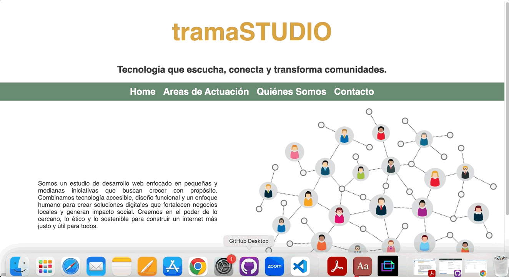

# Actividad 3 - Web Corporativa Responsiva

## Introducción

Este proyecto es una página web para una empresa fictícia llamada tramaSTUDIO. Ofrece informaciones básicas sobre la empresa y un formulario para contacto.

## Objetivos

Con la realización de esta actividad, se pretende asentar los conocimientos de HTML y CSS vistos en la materia de Lenguaje de Marcas y Sistemas de Gestión, con la realización de una página web corporativa.
También se pretende trabajar competencias tales como el trabajo en equipo, comunicación y organización por parte del alumnado, situaciones que se encontraran en el mundo laboral.

### Requerimiento 1
Realización página web corporativa según las pautas indicadas:
- Home:  Página principal del sitio
- Áreas de actuación (diseño libre): En esta página se mostrarán los diferentes servicios de la empresa.
- Quiénes somos: Página con un texto y una foto con la descripción de la empresa
- Formulario de contacto: En este formulario debes de usar TODOS los elementos HTML5 asociados a los formularios las veces que sean necesarias, debe de ser un formulario bien diseñado a las necesidades de tu página web.

### Requerimiento 2
Vamos a realizar un menú desplegable basado en listas de HTML, donde por medio de CSS le daremos un aspecto visual atractivo y con solapas desplegables. Dichas solapas llevarán a las páginas operativas descritas anteriormente.

### Requerimiento 3
Realizar la adaptación de la página web completa para dispositivos móviles.
La página debe optimizarse para visualizarse en los siguientes dispositivos (debe verse claramente que los elementos son modificados en cada caso):
• Adaptación de ancho fijo de resoluciones de más de 1300px de ancho.
• Adaptación optimizada para verse en una tablet en posición vertical.
• Adaptación optimizada para verse en una tablet en posición horizontal.
• Adaptación optimizada para verse en un teléfono posición vertical.
• Adaptación optimizada para verse en un teléfono posición horizontal.

### Requerimiento 4
Se pide como labor de investigación que los alumnos suban la actividad a github.io o algún otro hosting gratuito para que se pueda ver en la web.

**Mira la aplicación online [aquí](https://tanimaraeliassantos.github.io/web-corporativa-daw/).**

## Características

- Página principal con elemento interactivo que lleva usuarios a páginas secundarias
- Página secundaria con formulario para que el usuario pueda entrar en contacto con la empresa enviando sus datos
- Páginas secundariaas con informaciones relevantes al negocio de la empresa

## Technologies

- CSS
- HTML

### Autora

[Tanimara Elias Santos](https://github.com/tanimaraeliassantos)

### Versión

1.0.0
